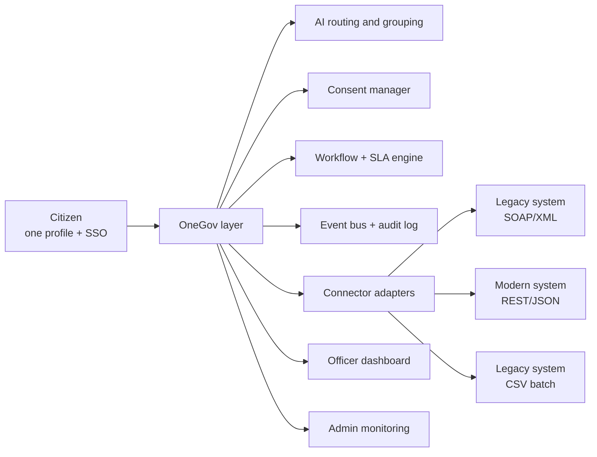

# 🏛️ OneGov — one window to every government department

**Smart India Hackathon 2026** · Problem: *System integration and interoperability among government digital platforms, resulting in fragmented service delivery*

Citizens today visit many portals and offices, type the same details again and again, and cannot track their requests in one place. Officers have no single view, and many similar complaints reach them one by one.

**OneGov** is an interoperability layer that sits *on top of* existing department systems (no replacement needed). The citizen creates **one profile**, signs in **once**, describes a need in plain words, and OneGov routes it to the right department. Officers get one dashboard, and AI groups similar complaints so they can be solved together.

> All departments, registries and data in this demo are **simulated**. Use dummy details only.

## What is implemented (mapped to the problem statement)

| Expected outcome | In OneGov |
|---|---|
| API-based exchange, reusable connectors for legacy and modern systems | Adapters for **REST/JSON**, **SOAP/XML** and **CSV-batch** systems. One common record is translated to each department's format (`logic.py`, Admin → Connectors shows the real message) |
| Common data standards, master-data management | One **master profile** + one canonical request record. Forms are auto-filled, so nothing is typed twice |
| Consent-based data sharing | **Consent manager**: each data source (Aadhaar eKYC, revenue records, etc.) is used only after the citizen allows it. Grant/revoke is logged |
| Single sign-on / federated identity | One OneGov login works for every department service. Role-based access: citizen, department officer, admin |
| Unified application tracking | "My applications": all requests from all departments, one ticket format, one timeline |
| Configurable workflow orchestration | Separate workflows for complaints and applications; **SLA per service is editable** in Admin → Workflow config |
| Event-driven notifications | Every action emits an event (`application.routed`, `status.changed`, ...) that becomes a citizen notification |
| Audit logs, role-based access | Full audit trail (Admin → Audit log). Officers only see their department's requests and only consented data |
| Data-quality checks | Profile validation (mobile, Aadhaar, PIN, email, DOB) and duplicate-identity detection |
| Exception handling and monitoring | Simulate a department outage: requests are **queued**, then delivered on retry. Monitoring dashboard shows SLA compliance, duplicates blocked, fields auto-filled, connector health |
| Fewer duplicate submissions | Duplicate requests for the same service are detected and blocked |
| AI-based routing and grouping | Search "paani nahi aa raha" → Water Board. Similar complaints are **grouped** (same service, same ward or same problem) for bulk action |

## Architecture



## Run locally
```
pip install -r requirements.txt
streamlit run app.py
```
Optional: set `GEMINI_API_KEY` (env var or Streamlit secret) for AI routing and summaries. Without a key, smart keyword routing (English, Hinglish, Hindi) is used.

## Demo accounts
| Role | Email | Password |
|---|---|---|
| Citizen | `ramesh.kumar@gov.in` | `Citizen@2026` |
| Officer (any department) | `<dept>.officer@gov.in`, e.g. `water.officer@gov.in` | `Officer@2026` |
| Admin | `admin@gov.in` | `Admin@2026` |

Data is shared between all visitors of the demo, so a citizen on one phone and an officer on another see the same requests live.

## Files
- `app.py` — Streamlit UI (citizen, officer, admin)
- `logic.py` — services, routing, consent, connectors, workflow, events, audit, grouping, data quality (no UI code)
- `ai.py` — optional Gemini helpers with retry and model fallback

## Honest limits
Connectors, registries (Aadhaar eKYC, revenue records, etc.) and department systems are simulated. Data lives in memory and resets when the app restarts. A production version would use real APIs, a database, and proper identity (for example, government SSO).
